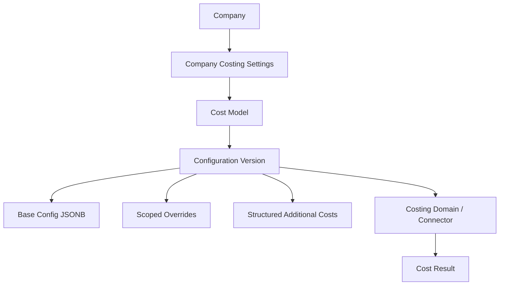

# STDTEX Company Costing Settings V1

Status: REVIEWED DESIGN ONLY
Runtime impact: none  
Database impact: none  
Current checkpoint reviewed: `ed6109e docs: design company costing settings data model`
Reviewed SQL design: `database/design/company_costing_settings_v1_reviewed.sql`

## 1. Product Goal

Company Settings -> Costing should let a Company Admin manage costing assumptions without touching formula code.

The core product rule remains:

The cost model defines how to calculate. The configuration defines which assumptions to use.

Cost Model 001 must start with current values already populated. A company must not start from an empty configuration. Admin edits should create a new draft configuration, validate/test it, and activate it atomically. Historical configurations remain explainable and must not be silently mutated.

## 2. Reviewed Current DB Compatibility

Read-only inspection was performed against the current production schema and compared with the local production baseline.

Current organization tables:

- `companies`: UUID primary key, `type` constrained to `Brand` or `Supplier`, RLS enabled.
- `profiles`: UUID primary key referencing `auth.users(id)`, legacy mirrored role/company fields, RLS enabled.
- `company_memberships`: UUID primary key, `user_id -> auth.users(id)`, `company_id -> companies(id)`, one-company-per-user unique index exists in baseline, RLS enabled.
- `company_groups`: UUID primary key, `company_id -> companies(id)`, unique `(company_id, name)`, RLS enabled.
- `company_group_memberships`: UUID primary key, users may belong to multiple groups inside their company, RLS enabled.
- `audit_logs`: UUID primary key, generic event log with `action`, actor/target/company/entity fields and JSONB previous/new values, RLS enabled.

Current business/style tables:

- `negotiation_rows`: `id bigint` primary key, current style/product commercial source. It stores text `origin`, text `temporada`, text `dept`, text `cat`, transport, FOB fields, units, target IMU, FSD, HOD and status.
- `showroom_collections_scoped`: UUID collection table still scoped by owner company/group/type text.
- `style_collection_assignments`: UUID assignment table linking `row_id bigint` to `negotiation_rows(id)`.

Important current representation facts:

- Platform Admin is not a normal company membership concept. The hardened design direction uses `private.current_is_platform_admin()`.
- Company Admin lives in `company_memberships.access_role = 'Company Admin'`.
- Company Member lives in `company_memberships.access_role = 'Company Member'`.
- Origin is currently text, not a country FK.
- Category is currently text, not a taxonomy FK.
- Season is currently text, not a date range.
- Departments, destination and transport are not normalized costing dimensions today.

Design consequence:

Costing V1 must reuse UUID company ownership and trusted membership authorization, but it must not invent master tables for origin/category/season before the product has them.

## 3. Current Proven Costing Requirements

Cost Model 001 evidence:

- Formula version: `1`
- Current runtime configuration: `CURRENT`
- Historical validation configuration: `FW26`
- Proven scoped override dimensions: `season + origin + category`
- FW26 validation:
  - Freight: `97 / 97` exact
  - Transit: `97 / 97` exact
  - Duty: `95 / 97` exact available references, `2` reference missing, `0` true mismatches
  - LDP: `95 / 97` matched/explained
  - IMU: `95 / 97` matched/explained

Historical conclusion:

The formula stayed stable. The assumptions changed by time/season plus origin plus category.

## 4. Final V1 Architecture

The reviewed target shape is:



This is the minimum robust schema:

- `cost_models`
- `company_costing_settings`
- `cost_config_versions`
- `cost_config_overrides`
- `cost_additional_components`

No calculation result ledger is created in V1.

## 5. Tables In Initial Design

The original design proposed:

- `cost_models`
- `company_costing_settings`
- `cost_config_versions`
- `cost_config_overrides`
- `cost_additional_components`

It also discussed future `style_cost_snapshots`.

## 6. Tables Removed Or Simplified

Removed from V1:

- No `style_cost_snapshots` table. The current workflow does not require a persisted calculation ledger.
- No separate variable-value tables. They are overbuilt for one characterized model and would increase RLS/write complexity.
- No `TESTED` lifecycle status. Testing is an action/result, not a durable lifecycle state needed for V1.
- No generic scope table, scope JSONB engine or priority engine.
- No formula table, expression table, SQL formula storage, JavaScript storage or custom script storage.

Simplified:

- Override scope is only `season_key`, `origin_key`, `category_key` for V1.
- Department, destination and transport are explicitly future dimensions, not V1 columns.
- Additional costs remain one structured table with safe calculation types only.

## 7. Final V1 Tables

### `cost_models`

Purpose: platform catalog of selectable costing model identities.

Required fields:

- `id uuid primary key`
- `code text unique not null`, e.g. `cost-model-001`
- `name text not null`
- `description text`
- `source_type text not null`
- `status text not null`
- `current_formula_version integer`
- `template_key text`
- timestamps

The table stores identity and availability only. It does not store formula code.

### `company_costing_settings`

Purpose: one active costing choice per company.

Required fields:

- `company_id uuid primary key references companies(id)`
- `cost_source_type text not null default 'FOB_ONLY'`
- `active_cost_model_id uuid references cost_models(id)`
- `active_config_version_id uuid references cost_config_versions(id)`
- `fallback_behavior text not null default 'FOB_ONLY'`
- `updated_by uuid`
- `updated_at timestamptz`

`ERP`, `COMPANY_API`, `THIRD_PARTY` and `FOB_ONLY` must not be forced into a local config version.

### `cost_config_versions`

Purpose: company-owned versioned assumption snapshots.

Required fields:

- `id uuid primary key`
- `company_id uuid references companies(id)`
- `cost_model_id uuid references cost_models(id)`
- `formula_version integer not null`
- `config_code text not null`, e.g. `CURRENT`, `FW26`
- `config_label text not null`
- `lifecycle_status text not null`, one of `DRAFT`, `ACTIVE`, `ARCHIVED`
- `base_config jsonb not null`
- `based_on_config_version_id uuid`
- optional `season_key`
- optional `effective_from`, `effective_to`
- created/updated/activated/archived metadata
- `source_reference`
- `notes`

Required constraints:

- unique `(company_id, cost_model_id, config_code)`
- one active config per `(company_id, cost_model_id)`
- `base_config` must be a JSON object
- `formula_version > 0`
- normalized `season_key` when present

### `cost_config_overrides`

Purpose: partial scoped assumptions on top of a config.

Required fields:

- `id uuid primary key`
- `config_version_id uuid references cost_config_versions(id)`
- `season_key text not null`
- `origin_key text not null`
- `category_key text not null`
- `values jsonb not null`
- `source_reference text`
- created/updated metadata

Required constraints:

- unique `(config_version_id, season_key, origin_key, category_key)`
- `values` must be a JSON object
- `season_key` and `origin_key` are uppercase trimmed keys
- category must be trimmed and non-empty

### `cost_additional_components`

Purpose: optional structured safe cost components.

Required fields:

- `id uuid primary key`
- `config_version_id uuid references cost_config_versions(id)`
- `name text not null`
- `calculation_type text not null`
- `value numeric not null`
- optional `currency`
- optional `percentage_basis`
- `enabled boolean`
- optional V1 scope fields: `season_key`, `origin_key`, `category_key`
- `source_reference`
- created/updated metadata

Allowed calculation types:

- `FIXED_PER_UNIT`
- `PERCENTAGE_OF_BASE`

Allowed percentage bases:

- `FOB`
- `FOB_PLUS_FREIGHT`
- `LANDED_BEFORE_ADDITIONAL_COSTS`

No raw expressions, JavaScript, SQL, custom scripting or formula strings.

## 8. Model Representation

Cost Model 001 is represented by stable code:

- `cost-model-001`

Formula implementation remains in the costing domain code.

The DB stores:

- model identity
- model availability
- current formula version number
- template key/reference
- company-selected active configuration

The DB must not store:

- JavaScript
- SQL formula implementations
- arbitrary expressions
- customer-defined executable code

## 9. Formula Version

Formula version changes only when the mathematical/business logic changes.

Cost Model 001 currently has:

- formula version `1`

Use column name:

- `formula_version`

Avoid generic `version` for this concept.

## 10. Config Version

Configuration version changes when assumptions/rates change while formula logic stays the same.

Use:

- `config_code`
- `config_label`
- `lifecycle_status`

Examples:

- `CURRENT`
- `FW26`
- `SS27-DRAFT`

Avoid generic `version` because it confuses formula version and config version.

## 11. Template Strategy

Recommendation: hybrid with application/domain template as source of truth.

The canonical Model 001 defaults already live in `src/features/costing/costModel.js`.

When a company enables Model 001:

1. Backend reads the canonical domain template for `cost-model-001/current`.
2. Backend creates a complete company-owned config snapshot.
3. Company Admin edits a duplicate draft later if needed.

Do not create a second competing platform-default JSON blob that can drift from domain code.

`cost_models.template_key` is enough for the database to identify which domain template to clone.

## 12. Base JSONB Strategy

`base_config` should be JSONB because Model 001 and future Model 002 may have different variable sets.

Validation must not rely only on frontend checks.

Recommended validation layers:

- domain variable metadata in application code
- controlled server command validation
- light DB structural constraints

PostgreSQL should verify shape and ownership, not become a universal JSON schema engine.

## 13. Override Representation

Use explicit V1 columns:

- `season_key`
- `origin_key`
- `category_key`

Use JSONB `values` only for the partial changed values.

Example:

```json
{
  "duty": {
    "fixedDuty": 2.2,
    "dutyPercent": 0
  }
}
```

Values not present inherit from `base_config`.

## 14. Season Design

Season is a normalized text key.

Rules:

- trim whitespace
- uppercase
- do not infer from dates
- do not guess from current date

Examples:

- `FW26`
- `SS27`

Future effective dates may exist, but they are not a replacement for season evidence.

## 15. Origin Design

Origin remains a normalized text key in V1.

Rules:

- trim whitespace
- uppercase
- reject blank origin in overrides

Examples:

- `VIETNAM`
- `BANGLADESH`

Do not introduce a country master migration in Costing V1.

## 16. Category Design

Category remains text in V1 because `negotiation_rows.cat` is text today.

Rules:

- trim whitespace
- reject blank category in overrides
- preserve existing display casing for category matching

Do not invent a new enterprise taxonomy during Costing V1.

## 17. Future Effective Dates

Do not require effective dates in V1.

If added later, the clearest first place is `cost_config_versions` because dates describe the assumption snapshot's validity window.

Avoid separate date windows on both config and override until there is evidence for mid-config temporal overrides.

## 18. Config Lifecycle

Minimum lifecycle:

- `DRAFT`
- `ACTIVE`
- `ARCHIVED`

`TESTED` is removed as a persisted status. Testing should create a validation result, warning or UI state, not a durable lifecycle status.

## 19. Immutability

Rules:

- `DRAFT`: editable through controlled commands.
- `ACTIVE`: not directly editable.
- `ARCHIVED`: not editable.

Normal flow:

1. Duplicate active config into draft.
2. Edit draft.
3. Test draft.
4. Activate draft atomically.
5. Archive previous active config in the same transaction.

Enforcement belongs in a minimal combination of:

- controlled RPCs
- strict RLS
- optional DB trigger/check for immutable states

## 20. One-Active-Config Rule

V1 rule:

One active config per company plus cost model.

Constraint:

- unique partial index on `(company_id, cost_model_id)` where `lifecycle_status = 'ACTIVE'`

Do not implement multiple simultaneous effective configurations in V1.

## 21. Historical Config Rule

Historical configurations such as FW26 are company-scoped evidence.

They must not become global platform defaults.

They should be stored as:

- `ARCHIVED` historical config
- or imported validation fixture/config for the relevant company

They must not leak commercial rates to unrelated companies.

## 22. Additional Costs

Keep V1 narrow:

- one optional structured table
- no custom formulas
- no generic cost engine

Only include fields justified by product needs:

- fixed per unit
- percentage of a defined basis

## 23. Calculation Trace

No calculation ledger in V1.

Future result snapshots should record:

- `cost_model_code`
- `formula_version`
- `config_version_id`
- `cost_source_type`
- `calculated_at`
- calculation context/result JSON

Old buying decisions should not silently change when a new config activates.

## 24. Deletion Semantics

Recommended:

- unused `DRAFT`: may hard delete
- `ACTIVE`: no hard delete
- historically referenced config: no hard delete
- `ARCHIVED`: preserved

Because V1 has no production usage yet, staging rollback may remove all isolated costing infrastructure. After production usage, rollback must preserve referenced config history.

## 25. Access Matrix

| Actor | cost_models | company_costing_settings | cost_config_versions | overrides | additional costs | audit_logs |
| --- | --- | --- | --- | --- | --- | --- |
| ANON | No access | No access | No access | No access | No access | No access |
| Company Member | No raw config access by default | No raw config access by default | No raw config access by default | No access | No access | No access |
| Company Admin | Read own company settings | Manage own company through commands | Manage own company drafts through commands | Manage own company draft overrides through commands | Manage own company draft costs through commands | Indirect events only |
| Platform Admin | Global read/manage | Global read/manage | Global read/manage | Global read/manage | Global read/manage | Global support/debug |
| Backend/Service | Controlled command execution | Controlled command execution | Controlled command execution | Controlled command execution | Controlled command execution | Insert events |

Buyer/member product surfaces should consume resolved results, not raw configuration tables.

## 26. RLS Strategy

Design only; no policies are implemented in this phase.

Rules:

- enable RLS on all costing tables before API exposure
- no anon policies
- no `USING (true)`
- avoid `TO public`
- do not authorize from user-editable profile metadata
- prefer hardened helpers:
  - `private.current_is_platform_admin()`
  - `private.current_is_company_admin_for(company_id)`
- sensitive writes go through command RPCs
- direct table updates are either denied or restricted to platform-admin support paths

Production currently still contains some legacy policy patterns such as email-based platform admin checks. Costing should not copy those patterns; it should align with the hardened Organization Security direction.

## 27. Command/RPC Layer

Minimal proposed commands:

### `set_company_cost_source(company_id, cost_source_type, cost_model_code default null)`

Caller:

- Company Admin for own company
- Platform Admin

Validates:

- authenticated caller
- company ownership/admin rights
- supported source type
- selected model availability
- local config required only for `STDTEX_MODEL`

Result:

- updated company costing source
- audit event

### `create_cost_config_draft(company_id, cost_model_code, config_label, based_on_config_version_id default null)`

Creates a complete `DRAFT` snapshot from canonical domain template or existing config.

Validates:

- caller authorization
- model exists and is available
- formula version compatibility
- config code uniqueness
- base config shape

### `duplicate_cost_config(config_version_id, new_config_label)`

Copies base config, overrides and additional components into a new `DRAFT`.

### `update_cost_config_draft(config_version_id, patch jsonb)`

Validates:

- caller authorization
- config belongs to caller company
- config is `DRAFT`
- known Model 001 variable keys
- correct types and allowed ranges
- no authorization fields in patch

### `upsert_cost_override(config_version_id, scope jsonb, values jsonb)`

Validates:

- caller authorization
- parent config is `DRAFT`
- scope has season/origin/category
- normalized scope keys
- no duplicate/conflicting exact scope
- known variable keys and types

### `remove_cost_override(override_id)`

Validates:

- caller authorization
- parent config is `DRAFT`

### `add_cost_component`, `update_cost_component`, `remove_cost_component`

Validates:

- caller authorization
- parent config is `DRAFT`
- supported calculation type
- allowed basis
- non-negative value

### `activate_cost_config(config_version_id)`

Must be atomic:

1. lock company costing settings/config rows
2. validate DRAFT status
3. validate model availability
4. validate formula version
5. validate base config and overrides
6. archive previous active config for same company/model
7. activate selected config
8. update `company_costing_settings`
9. write audit event
10. commit or rollback all

### `archive_cost_config(config_version_id)`

Refuse archiving the current active config unless replacement activation happens in the same transaction.

## 28. Calculation Execution Layer

Postgres owns:

- config storage
- version lifecycle
- authorization
- activation transaction

Costing domain/connector owns:

- formula execution
- effective config resolution
- test calculation execution
- result mapping

`test_cost_config` should call the same Costing domain implementation, likely through an application service or Supabase Edge Function. Do not duplicate Cost Model 001 formulas in SQL.

## 29. Audit Strategy

Reuse existing `audit_logs`.

Suggested events:

- `COST_SOURCE_CHANGED`
- `COST_CONFIG_CREATED`
- `COST_CONFIG_UPDATED`
- `COST_OVERRIDE_UPSERTED`
- `COST_OVERRIDE_REMOVED`
- `COST_COMPONENT_ADDED`
- `COST_COMPONENT_UPDATED`
- `COST_COMPONENT_REMOVED`
- `COST_CONFIG_ACTIVATED`
- `COST_CONFIG_ARCHIVED`

No separate costing audit table in V1.

## 30. Model 001 Seed Strategy

Future seed:

- `code = cost-model-001`
- `source_type = STDTEX_MODEL`
- `current_formula_version = 1`
- `template_key = cost-model-001/current`

Do not persist formula source code.

## 31. CURRENT Creation

Recommendation:

Initial Model 001 enablement should auto-create and auto-activate a company-owned `CURRENT` config because it reproduces existing canonical defaults.

Reason:

- avoids empty/broken costing state
- keeps current behavior available immediately
- lets Company Admin duplicate active config into draft later

Open product decision:

If enterprise governance requires explicit approval, switch this to draft-first before staging migration.

## 32. FW26 Handling

FW26 is historical evidence, not global default.

It should be imported only for the relevant company context as:

- `config_code = FW26`
- `lifecycle_status = ARCHIVED`
- `formula_version = 1`
- base config equivalent to current defaults plus scoped duty overrides

The exact FW26 commercial overrides must not leak to unrelated companies.

## 33. FOB-Only Handling

No config means:

- STDTEX still works
- FOB remains the native commercial cost field
- `company_costing_settings.cost_source_type = FOB_ONLY`

Do not create a fake FOB cost model.

## 34. ERP Future Compatibility

ERP must be represented as a company cost source without requiring local editable Model 001 config rows.

This is why `company_costing_settings.cost_source_type` is separate from `cost_config_versions`.

## 35. Model 002 Future Compatibility

Model 002 can expose a different variable set without adding columns because:

- `base_config` is JSONB
- allowed variables are validated by model metadata in domain/server code
- overrides store partial JSONB values
- formula implementation remains outside DB

Do not create Model 002 now.

## 36. Option Scores

Score: 1 worst, 5 best.

| Criterion | Option A normalized variable rows | Option B JSONB base config + normalized overrides |
| --- | ---: | ---: |
| Simplicity | 2 | 5 |
| Model 002 flexibility | 3 | 5 |
| Versioning | 4 | 5 |
| Override support | 4 | 4 |
| Company Admin UX | 3 | 5 |
| RLS complexity | 2 | 4 |
| Queryability | 5 | 3 |
| Auditability | 4 | 4 |
| Migration effort | 2 | 5 |
| Overengineering risk | 2 | 4 |

Final recommendation:

Option B, with explicit V1 override columns and command-layer validation.

## 37. Red-Team Results

### Cross-company

Prevented by:

- `company_id` on `company_costing_settings`
- `company_id` on `cost_config_versions`
- command validation for active config ownership
- company-admin helper authorization
- no direct arbitrary writes

Future migration must add a trigger or RPC-only enforcement to prevent `company_costing_settings.active_config_version_id` from pointing to another company's config.

### Versioning

Expected prevention:

- edit active config: rejected by command validation/immutability trigger
- edit archived config: rejected
- delete active config: rejected
- duplicate active config: allowed into new draft
- activate same config twice: idempotent no-op or controlled error
- two active configs: rejected by unique partial index
- activate config from wrong model: rejected by activation command
- formula version mismatch: rejected by activation command

### Overrides

Expected prevention:

- duplicate exact scope: unique key
- wrong season: rejected by normalization/validation
- empty origin/category: rejected
- unknown category: warning or rejection according to domain metadata; do not create taxonomy yet
- wrong value type: command validation
- unknown variable key: command validation
- FW26 affecting SS27: impossible unless scope matches `season_key = FW26`
- case/space collisions: prevented by normalized season/origin and trimmed category checks

### ERP

Company with `cost_source_type = ERP` does not need local config rows.

### Model 002

Different variable set can live in JSONB with model-specific validation.

## 38. Staging Migration Plan

Next phase should create a migration draft only, then staging validation:

1. baseline/checkpoint staging
2. create costing tables
3. enable RLS
4. revoke anon and deny broad direct writes
5. create or reuse hardened private helpers
6. create command RPCs
7. seed Model 001 identity/template reference
8. create synthetic company draft/current config
9. load CURRENT config
10. run Model 001 parity
11. load FW26 historical configuration
12. validate scoped resolution
13. run Company Admin JWT attack tests
14. run normal-member attack tests
15. run Platform Admin tests
16. run activation transaction tests
17. rollback
18. reapply
19. only then build frontend Settings

## 39. Rollback Design

Pre-production staging rollback:

- export costing tables if test data matters
- drop costing policies/RPCs/helpers that were introduced only for costing
- drop costing indexes
- drop costing tables in dependency order
- verify no runtime references depend on them

Post-production rollback concern:

- do not orphan historical calculation/config references
- archive/disable UI before destructive removal
- preserve config history if any buying decisions reference it

## 40. Genuine Product Decisions

Only these require product approval:

1. Initial Model 001 enablement:
   - auto-active `CURRENT`
   - or draft-first explicit activation
2. Can Company Admin activate directly, or should a future Finance/Costing permission approve?
3. Should Buyer see only estimated landed/IMU, or also model/config provenance?

## 41. Readiness Recommendation

READY TO CREATE COSTING SETTINGS STAGING MIGRATION DRAFT.

Do not apply SQL yet.
Do not build UI yet.
Do not change runtime formulas.
Do not change Negotiation.
