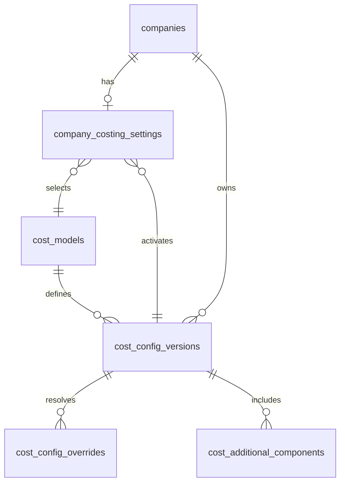
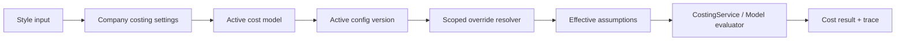

# STDTEX Company Costing Settings Data Model

Status: DESIGN ONLY  
Runtime impact: none  
Database impact: none  
Current checkpoint: `159bc4c refactor: add versioned duty configuration resolution`

## 1. Product Goal

Company Settings -> Costing should let a Company Admin manage costing assumptions without touching formula code.

The core product rule is:

The cost model defines how to calculate. The configuration defines which assumptions to use.

Cost Model 001 must open with today's current values already populated. A company must not start from an empty configuration. Admin edits should create a new draft configuration version, test it, and then activate it atomically. Historical configurations remain explainable and should not be silently mutated.

## 2. Proven Requirements

Current proven Cost Model 001 facts:

- Formula version: `1`
- Current runtime configuration: `CURRENT`
- Historical validation configuration: `FW26`
- Proven scoped override dimensions: `season`, `origin`, `category`
- Current precedence: model default -> matching season + origin + category override
- Formula did not change during FW26 validation. Historical assumptions changed.

Future Company Admin must eventually be able to:

- Select a cost source or active cost model.
- View and edit current assumptions.
- Configure duty, freight, FX, VAT, target IMU, insurance, weight uplift and future costs.
- Create scoped overrides.
- Test draft configuration results before activation.
- Activate a configuration version while preserving historical versions.

## 3. Existing Company And Domain Audit

Existing normalized company tables in the production baseline:

- `companies`: company identity, `type` constrained to `Brand` or `Supplier`, logo and public profile fields.
- `company_groups`: groups scoped to a company.
- `company_memberships`: one company per user, access role such as `Company Member` or `Company Admin`.
- `company_group_memberships`: many groups per user inside the same company.
- `company_invitations`: company invitation workflow.
- `profiles`: legacy/profile mirror fields including role, company names, company type and access role.

Existing style/product table:

- `negotiation_rows`: still the broad style/source-of-truth table. It stores `origin`, `temporada`, `dept`, `cat`, `transport`, `pvp_rub`, FOB fields, units, target IMU, status, FSD and HOD.

Existing collections tables:

- `showroom_collections_scoped`: collections scoped by company name/group/type as text.
- `style_collection_assignments`: links `negotiation_rows.id` to collection name and owner scope.

Current domain representations:

- Company type is normalized in `companies.type` as `Brand` or `Supplier`.
- Company Admin and Company Member live in `company_memberships.access_role`.
- Platform Admin exists as application/profile role and must not require company membership.
- Groups are normalized by id in `company_groups`, but some collection scope fields still use group names.
- Departments are not normalized as a canonical DB table. Style department currently comes from `negotiation_rows.dept` and hardcoded/runtime option lists.
- Categories are not normalized as a canonical product taxonomy. Style category currently comes from `negotiation_rows.cat` and duty rows in runtime code.
- Origin is text in `negotiation_rows.origin` and runtime duty/freight maps. It is usually uppercase country/origin text, not a country-id FK.
- Season is text in `negotiation_rows.temporada` and runtime `SEASONS`.
- Destination is not a first-class field in `negotiation_rows`; Russia/RUB assumptions are currently embedded in Model 001.
- Transport mode is text in `negotiation_rows.transport` and freight route maps.

Implication: costing V1 should not create fake foreign keys to department/category/origin master tables that do not yet exist. It should store normalized text keys now and leave space to add FKs later.

## 4. Existing Costing Domain Audit

Current costing files:

- `src/features/costing/costModel.js`
- `src/features/costing/costConnector.js`
- `src/features/costing/costService.js`
- `src/features/costing/costResultModel.js`
- `src/features/costing/index.js`

Current domain objects:

- `CostModel001Status`
- `CostingSourceType`
- `CostingResultStatus`
- Cost Model 001 identity: `cost-model-001`
- Formula version: `1`
- Configuration codes: `CURRENT`, `FW26`
- Default assumptions:
  - insurance rate
  - gross weight uplift
  - RUB/USD exchange rate
  - EUR/USD exchange rate
  - VAT
  - target IMU
  - fallback duty
  - default origin
  - default transport
- Variable metadata in `COST_MODEL_001_VARIABLES`
- Duty overrides with `scope`, `period`, `values`, `source`
- Configuration resolver
- Pure evaluator
- Connector adapter
- Cost result wrapper

Persistence must support these objects without moving formula logic into the database.

## 5. Core Costing Concepts

Cost model:

- Stable identity for a calculation methodology.
- Example: `Cost Model 001`.
- Stored in DB only as selectable metadata. Formula JavaScript remains in application/domain code.

Cost model formula version:

- Version of the formula implementation.
- Example: formula version `1`.
- Changes only when calculation behavior changes.

Cost configuration version:

- Versioned assumption set for a company and model.
- Example: `CURRENT`, `FW26`, `SS27 Draft`.
- Changes when rates/assumptions change while formula remains stable.

Cost override:

- Partial scoped difference from a base configuration.
- Example: `season=FW26`, `origin=VIETNAM`, `category=Pants Commercial`, `fixedDuty=2.2`, `dutyPercent=0`.

Cost result:

- Future calculation trace or snapshot that records which model/config produced a displayed result.
- Not required as a table in V1.

## 6. Model Identity Design

Recommended model identity fields:

- `id`: UUID
- `code`: stable unique code, e.g. `cost-model-001`
- `name`
- `description`
- `source_type`: one of `STDTEX_MODEL`, `ERP`, `COMPANY_API`, `THIRD_PARTY`, `FOB_ONLY`
- `status`: `AVAILABLE`, `DEPRECATED`, `DISABLED`
- `current_formula_version`
- `created_at`
- `updated_at`

Do not store formula JavaScript in the database. The DB selects/configures models; it does not execute arbitrary customer code.

## 7. Cost Source Type Design

V1 source types:

- `FOB_ONLY`
- `STDTEX_MODEL`
- `ERP`
- `COMPANY_API`
- `THIRD_PARTY`

`FOB_ONLY` should be the safe fallback when no costing source is enabled. `STDTEX_MODEL` is the source type for Cost Model 001. Other source types are metadata only until connectors exist.

## 8. Configuration Version Design

Recommended lifecycle statuses:

- `DRAFT`
- `TESTED`
- `ACTIVE`
- `ARCHIVED`

Recommendation: one `ACTIVE` configuration per company and cost model at a time for V1.

Reason:

- It is deterministic and easy for Negotiation to consume.
- It avoids ambiguous overlapping effective periods.
- Season/historical lookup can still happen by requesting a specific config code such as `FW26`.
- Multiple effective-date active configs can be added later after real evidence.

Recommended fields:

- `id`
- `company_id`
- `cost_model_id`
- `formula_version`
- `code`
- `name`
- `status`
- `base_config`: JSONB snapshot
- `based_on_version_id`
- `season`
- `effective_from`
- `effective_to`
- `created_by`
- `created_at`
- `updated_by`
- `updated_at`
- `tested_by`
- `tested_at`
- `activated_by`
- `activated_at`
- `archived_at`
- `notes`

`season`, `effective_from` and `effective_to` are optional metadata, not required for every config.

## 9. Variable Definition Design

Variable definitions should remain hybrid:

- Canonical stable model metadata remains in application/domain code.
- The database stores config values and optional snapshots of the model version used.

Why:

- Stable formula metadata is code-owned.
- UI can still render from model metadata exposed by the app.
- The DB avoids becoming a generic formula/rules engine.
- Version snapshots keep historical values explainable.

Model 001 variable definitions include:

- `insuranceRate`
- `grossWeightUplift`
- `rubExchangeRate`
- `eurExchangeRate`
- `vatRate`
- `targetImu`
- `fallbackDutyRate`
- `defaultOrigin`
- `defaultTransportMode`

Future metadata may include editability, type, unit, validation and allowed scopes.

## 10. Variable Value Design

Two viable options were evaluated.

### Option A: normalized variable-value rows

Tables:

- `cost_config_versions`
- `cost_config_values`
- `cost_config_overrides`
- `cost_config_override_values`

Benefits:

- Strong queryability per variable.
- Fine-grained uniqueness and audit.
- Easy to diff a single variable.

Costs:

- More tables and joins.
- Higher RLS complexity.
- More write paths.
- More UI mapping work.
- Overbuilt for the current single proven model.

### Option B: versioned JSONB config plus normalized override rows

Tables:

- `cost_config_versions` with JSONB `base_config`
- `cost_config_overrides` with JSONB `values`
- `cost_additional_components` with structured rows

Benefits:

- Small table count.
- Natural version snapshots.
- Partial overrides stay simple.
- Better fit for current Model 001 config shape.
- Lower RLS and migration complexity.
- Easy to instantiate from current defaults.

Costs:

- Less SQL-native per-variable querying.
- Requires server-side JSON validation.
- Needs careful JSONB shape checks.

Recommendation: Option B.

Reason: STDTEX has one characterized cost model today and proven need for versioned assumptions plus scoped partial overrides. Option B is auditable and extensible without building an enterprise meta-model too early.

## 11. Scoped Override Design

Recommended V1:

- Explicit normalized scope columns for proven dimensions:
  - `season_key`
  - `origin_key`
  - `category_key`
- Optional future columns:
  - `department_key`
  - `destination_key`
  - `transport_mode_key`
- JSONB `values` for the partial fields changed by the override.

Why explicit columns over a generic scope object:

- Safer uniqueness constraints.
- Easier indexes.
- Easier conflict detection.
- Better RLS and admin debugging.
- Avoids an arbitrary rules engine.

V1 should use normalized text keys:

- Season: uppercase trimmed code, e.g. `FW26`.
- Origin: uppercase trimmed stable country/origin key, e.g. `VIETNAM`.
- Category: trimmed exact category key, e.g. `Pants Commercial`.

Future normalized taxonomy can replace these text keys with FK columns later.

## 12. Scope Precedence

V1 precedence:

1. Base configuration.
2. Matching override with proven scope.

Within overrides, avoid ambiguity by preventing overlapping rows for the same scope and config. Do not invent department/destination/transport precedence until evidence requires it.

If future scopes are added, define numeric `scope_rank` in application code and require deterministic ordering. Never allow two matching overrides with the same rank and same variable keys.

## 13. Conflict Handling

Database constraints should prevent exact duplicate override scopes:

- unique `(config_version_id, season_key, origin_key, category_key, department_key, destination_key, transport_mode_key)`

Because nullable columns complicate uniqueness, use generated/coalesced normalized keys or expression indexes in the actual migration design.

Server validation should also reject:

- two overrides that set the same variable for the same effective scope
- invalid percentage ranges
- invalid empty required values
- unsupported variable keys for the selected cost model

## 14. Partial Override Behavior

Overrides store only changed values.

Example base config includes VAT, FX, insurance, duty defaults, freight, target IMU.

Example override:

```json
{
  "duty": {
    "fixedDuty": 2.2,
    "dutyPercent": 0
  }
}
```

Everything else inherits from base config.

The resolver should produce a complete effective configuration before calling the evaluator.

## 15. Additional Cost Design

V1 should support structured safe cost components only.

Allowed calculation types:

- `FIXED_PER_UNIT`
- `PERCENTAGE_OF_BASE`

Recommended fields:

- `id`
- `config_version_id`
- `name`
- `calculation_type`
- `value`
- `currency`
- `percentage_basis`
- `enabled`
- `scope` columns matching override scope columns
- `created_by`
- `created_at`
- `updated_at`

Do not allow raw JavaScript, SQL, custom scripts, arbitrary formulas or expression strings.

## 16. Season, Date And Historical Handling

Season is the current proven temporal key. Store it as normalized text such as `FW26`.

Do not infer dates from season.

Keep optional `effective_from` and `effective_to` on configuration versions and additional components so future mid-season FX or duty changes are not blocked.

Historical configs such as `FW26` can be imported as `ARCHIVED` or `TESTED`, not necessarily active.

## 17. Snapshot Vs Live Recalculation

Recommendation: old buying decisions should not silently recalculate when a config changes.

Future snapshots should record:

- `cost_model_id`
- `formula_version`
- `config_version_id`
- `cost_source_type`
- `calculated_at`
- calculation context
- summary result

Fresh calculations can use the current `ACTIVE` version. Historical decisions remain traceable to the version used at the time.

Do not create `style_cost_snapshots` in V1 unless a workflow needs persisted results.

## 18. Company Model Selector

Recommended `company_costing_settings` contract:

- `company_id`
- `costing_enabled`
- `cost_source_type`
- `active_cost_model_id`
- `active_config_version_id`
- `fallback_behavior`
- `updated_by`
- `updated_at`

The selector can later show:

- FOB only
- Cost Model 001
- Cost Model 002
- ERP connector
- Custom API
- Third-party

## 19. Model 001 Default Loading

When a company enables Cost Model 001:

1. Read Model 001 default config from application/domain template.
2. Create a company-owned config version with all current values populated.
3. Store the config as a full `base_config` JSONB snapshot.
4. Link `company_costing_settings.active_config_version_id`.

Recommendation: initial Model 001 default should become `ACTIVE` immediately when enabled.

Reason:

- It reproduces current Model 001 behavior with zero manual setup.
- A company can then duplicate it into a Draft for edits.
- This avoids an empty or broken costing state.

For companies that do not enable Model 001, fallback remains `FOB_ONLY`.

## 20. Immutability Rules

`ACTIVE` and `ARCHIVED` configurations should not be edited directly.

Normal edit flow:

1. Active v1
2. Duplicate to Draft v2
3. Edit Draft v2
4. Test Draft v2
5. Activate v2
6. Archive v1 or mark it inactive with historical trace

Database/RPC should reject direct mutation of `ACTIVE` or `ARCHIVED` rows except controlled status transitions.

## 21. Permissions Matrix

Company Admin:

- View own company costing settings.
- Create draft configurations for own company.
- Edit draft variables, overrides and additional costs.
- Test draft configurations.
- Activate validated drafts.
- Archive own company configs where permitted.
- Cannot edit another company.
- Cannot modify platform formula definitions.
- Cannot silently mutate historical versions.

Company Member / Buyer:

- Read calculation results and high-level provenance where product requires it.
- Should not edit costing configuration.

Platform Admin:

- Global read across company costing settings.
- Manage platform cost model catalog and default templates.
- Support/debug integrations.
- May manage company configurations through controlled admin APIs.
- Does not need company membership.

Future delegated permissions:

- Finance
- Logistics
- Costing Manager

Do not create these roles now. Design RPC authorization so later capabilities can be delegated without redefining all tables.

## 22. RLS Design

Conceptual rules:

- No anon access.
- Company members can read only their own company settings when product behavior requires it.
- Company Admin can manage own-company drafts.
- Company Admin cannot write another company's config.
- Platform Admin has global access without company membership.
- All sensitive writes should go through controlled RPCs.
- No `USING (true)` policies.
- Do not authorize from user-editable metadata.

Policies should align with the existing hardened organization security model and trusted membership tables.

## 23. RPC / Server Command Design

Future sensitive writes should use controlled RPCs:

- `set_company_cost_source`
- `enable_company_cost_model`
- `create_cost_config_version`
- `duplicate_cost_config_version`
- `update_cost_config_base`
- `upsert_cost_config_override`
- `remove_cost_config_override`
- `add_cost_component`
- `update_cost_component`
- `remove_cost_component`
- `test_cost_config`
- `activate_cost_config_version`
- `archive_cost_config_version`

RPCs must validate:

- current user permissions
- company scope
- config status
- model compatibility
- variable keys
- value ranges
- override conflicts

## 24. Activation Transaction

Activation must be atomic:

1. Validate draft status and config payload.
2. Confirm no conflicts.
3. Mark existing active config as archived or inactive.
4. Mark selected draft as active.
5. Update `company_costing_settings.active_config_version_id`.
6. Write audit log.
7. Commit as one transaction.

If any step fails, nothing changes.

## 25. Test Before Activate

`test_cost_config` should accept:

- draft config id
- sample style inputs
- optional calculation context

It returns:

- effective config trace
- calculation result
- validation warnings/errors

It should reuse `CostingService` and the Cost Model evaluator. Do not duplicate formula logic in SQL.

## 26. Recommended Future Tables

### `cost_models`

Purpose: platform catalog of available cost models/sources.

Primary key: `id uuid`

Important columns:

- `code text unique not null`
- `name text not null`
- `description text`
- `source_type text not null`
- `status text not null default 'AVAILABLE'`
- `current_formula_version integer`
- `created_at timestamptz`
- `updated_at timestamptz`

Constraints:

- source type enum/check
- status enum/check

RLS:

- authenticated read where available
- Platform Admin writes only

### `company_costing_settings`

Purpose: active costing choice per company.

Primary key: `company_id uuid`

Foreign keys:

- `company_id -> companies.id`
- `active_cost_model_id -> cost_models.id`
- `active_config_version_id -> cost_config_versions.id`

Important columns:

- `costing_enabled boolean`
- `cost_source_type text`
- `fallback_behavior text`
- `updated_by uuid`
- `updated_at timestamptz`

Constraints:

- one row per company
- active config must belong to same company, enforced through RPC/trigger if needed

RLS:

- own company read
- own company Company Admin managed through RPC
- Platform Admin global

### `cost_config_versions`

Purpose: immutable/versioned assumption sets.

Primary key: `id uuid`

Foreign keys:

- `company_id -> companies.id`
- `cost_model_id -> cost_models.id`
- `based_on_version_id -> cost_config_versions.id`

Important columns:

- `formula_version integer not null`
- `code text not null`
- `name text not null`
- `status text not null`
- `base_config jsonb not null`
- `season_key text`
- `effective_from timestamptz`
- `effective_to timestamptz`
- `created_by uuid`
- `created_at timestamptz`
- `updated_by uuid`
- `updated_at timestamptz`
- `tested_by uuid`
- `tested_at timestamptz`
- `activated_by uuid`
- `activated_at timestamptz`
- `archived_at timestamptz`
- `notes text`

Constraints:

- unique `(company_id, cost_model_id, code)`
- one active config per `(company_id, cost_model_id)`
- status enum/check
- `base_config` must be an object

RLS:

- own company read
- draft writes through RPC
- Platform Admin global

### `cost_config_overrides`

Purpose: partial scoped values applied on top of a config version.

Primary key: `id uuid`

Foreign keys:

- `config_version_id -> cost_config_versions.id on delete cascade`

Important columns:

- `season_key text`
- `origin_key text`
- `category_key text`
- `department_key text`
- `destination_key text`
- `transport_mode_key text`
- `values jsonb not null`
- `source text`
- `created_by uuid`
- `created_at timestamptz`
- `updated_at timestamptz`

Constraints:

- `values` must be an object
- no duplicate scope per config
- supported keys only, enforced by RPC/server validation

Indexes:

- `(config_version_id)`
- `(config_version_id, season_key, origin_key, category_key)`
- future indexes only when new dimensions are proven

RLS:

- inherits config company scope
- writes through RPC

### `cost_additional_components`

Purpose: structured safe company cost components.

Primary key: `id uuid`

Foreign keys:

- `config_version_id -> cost_config_versions.id on delete cascade`

Important columns:

- `name text not null`
- `calculation_type text not null`
- `value numeric not null`
- `currency text`
- `percentage_basis text`
- `enabled boolean default true`
- `season_key text`
- `origin_key text`
- `category_key text`
- `department_key text`
- `destination_key text`
- `transport_mode_key text`
- `created_by uuid`
- `created_at timestamptz`
- `updated_at timestamptz`

Constraints:

- calculation type check
- value range checks
- no arbitrary formula fields

RLS:

- inherits config company scope
- writes through RPC

### Future optional table: `style_cost_snapshots`

Do not create in V1. Future use only when persisted calculation snapshots are required.

Potential fields:

- `style_id`
- `company_id`
- `cost_model_id`
- `formula_version`
- `config_version_id`
- `cost_source_type`
- `calculation_context jsonb`
- `result jsonb`
- `calculated_at`

## 27. Indexes And Constraints Summary

Required V1 indexes:

- `cost_models(code)`
- `company_costing_settings(company_id)`
- `cost_config_versions(company_id, cost_model_id, status)`
- unique active config partial index on `(company_id, cost_model_id)` where status is `ACTIVE`
- unique config code index on `(company_id, cost_model_id, code)`
- `cost_config_overrides(config_version_id, season_key, origin_key, category_key)`
- `cost_additional_components(config_version_id)`

Required V1 constraints:

- status checks
- source type checks
- calculation type checks
- JSONB object checks
- no duplicate override scopes
- immutable statuses enforced through RPC and optional triggers

## 28. Relationship Diagram



Calculation flow:



## 29. Migration Strategy

Future rollout sequence:

1. Create schema in staging only.
2. Seed Cost Model 001 catalog record.
3. Seed or expose Model 001 default template from application code.
4. Create company costing settings for test companies.
5. Instantiate `CURRENT` values as company-specific config versions.
6. Optionally import FW26 historical config as non-active historical config.
7. Connect resolver to persisted config behind a fallback.
8. Verify parity against current code defaults.
9. Add Company Settings UI.
10. Validate activation/test RPCs.
11. Only then consider production migration.

## 30. Fallback Behavior

If DB-backed costing config is missing:

- If company has not enabled costing: use `FOB_ONLY`.
- If company enabled Cost Model 001 but config lookup fails: fail closed to explicit `NOT_AVAILABLE` with an error state, not silent invented values.
- During migration only: application may temporarily fall back to code defaults for parity testing, but this must be logged/visible in validation.

## 31. Company Admin UX Contract

Future Settings -> Costing should show:

- active source/model
- current active config
- variables grouped by General, FX, Tax, Duties, Freight, Logistics, Target
- scoped overrides table
- additional costs table
- Test model action
- Duplicate as Draft action
- Activate Draft action
- configuration history
- audit trace

Normal buyer workflows should remain simple and only see results/provenance.

## 32. Open Product Decisions

- Should some companies delegate costing management to Finance or Logistics roles?
- Should initial Model 001 enablement be automatic for all companies or opt-in?
- Should active configs eventually support effective date windows?
- Should category and origin become normalized platform taxonomies before persisted costing?
- What is the exact UI wording for estimated versus confirmed cost?
- Which historical configurations should be imported first after FW26?

## 33. Readiness Recommendation

READY FOR REVIEW OF COSTING SETTINGS SCHEMA.

Do not implement until this design is approved and the next phase explicitly authorizes staging schema work.

